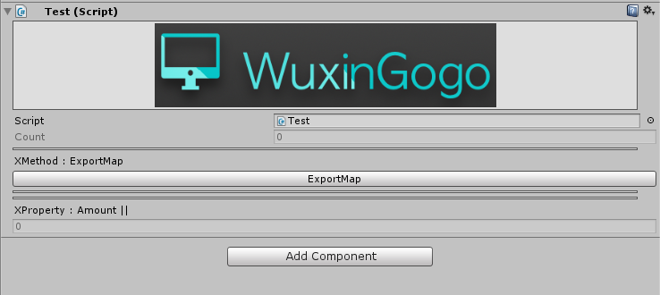

# WuxingogoExtension

## Intro
------

WuxingogoExtension is a Unity 3D plugin for build good game.
This repository includes the source code of the WuxingogoExtension libraries。


##Features
------

* Export UGUI to CocosUI(3.x).
* Unity Editor support: Reflection Method, Field and Property on the ReflectionWindow.
* Unity Editor support: Create AssetBundle extension (Unity version 4.x).
* Unity Editor Extension: Custom Attribute Collection(Inspector Drawer).
* Unity Editor support: Quick set unity prefs.
* Unity Editor support: Generated CSharpCode(CodeDom).
* Unity Editor support: Finite-State-Machine and Editor.
* Including a GameManager to easily manage your game.(inherit ScriptableObject)

##Usage
-----------

####XAssetBundleWindow. (Unity Version 4.X)

 

####XBehaviour Window (Finite-State-Machine)

Finite-State-Machine Window.

 

####XCodeGenerateEditor:

`Save Template`

Generate `Namespace`,`Field`, `Method`, `Class`, `Comment`, `Attribute`, `Property`

TODO LIST: 

Compile Code From XReflectionWindow.

A visual window to generate csharp code.

 

####XReflectionWindow:

 


#### 3RD-Attribute

Note: This script must inherit from XMonoBehaviour.

```c#
    [X]		// Create a button on the Inspector
    public void ExportMap()
    {
        MapMangment.Export();
    }
    [X]		// Reflection this property on the Inspector
    public int Amount
    {
        get{
        	return 0;
    	}
    }
    [Disable]	// Disable change this SerializeField
    public int Count = 0;
```
 

Etc.

##Copyright, License & Contributors
-----
MIT license

Contcat:52111314ly@gmail.com

To be continue!


