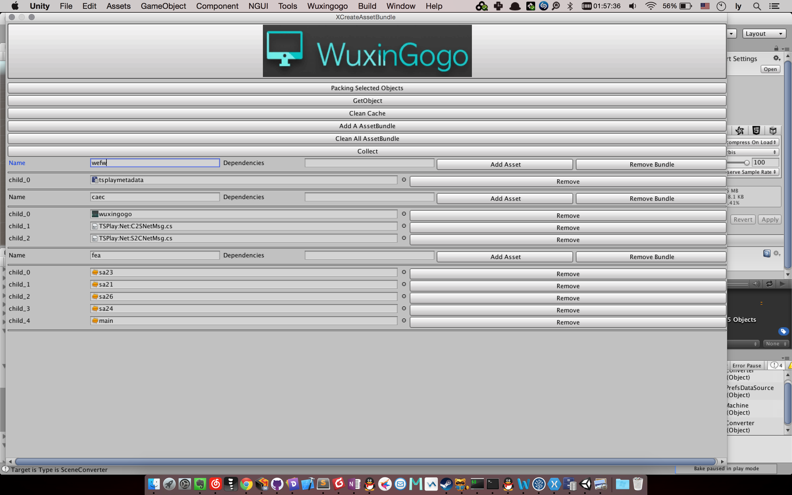
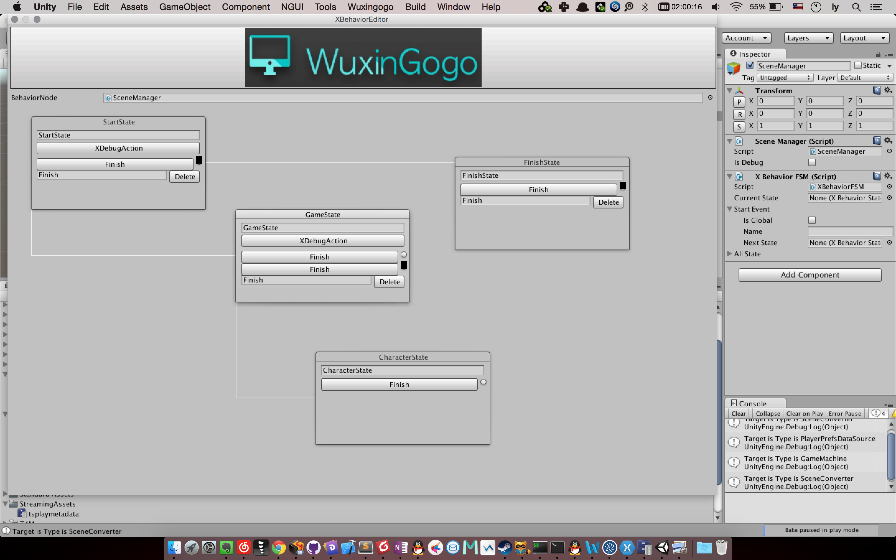
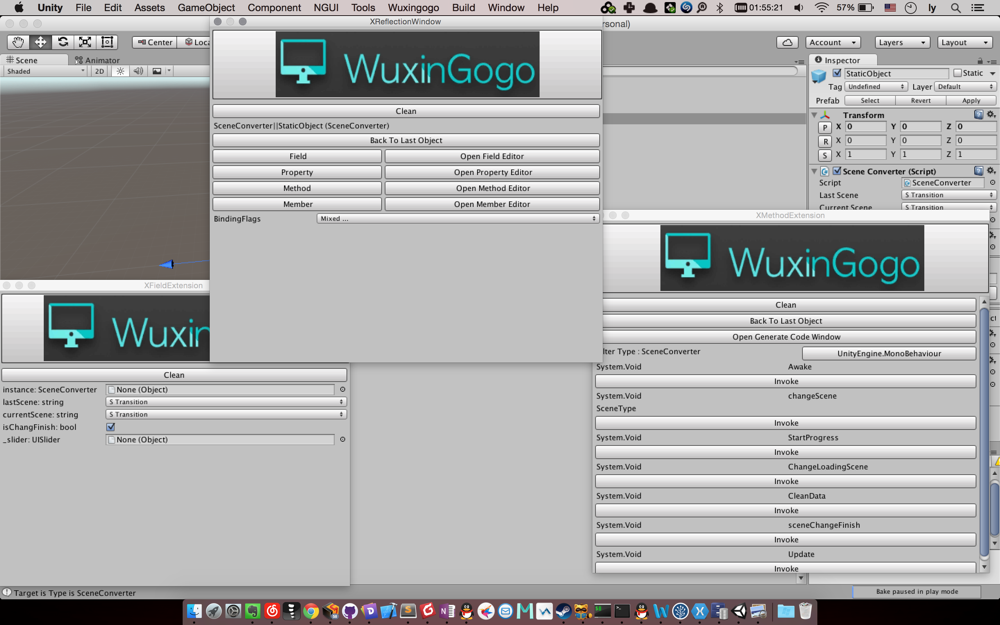

# WuxingogoExtension

## Intro
------

Unity Editor extension.

##Features
------

* Export UGUI(Can Use to Cross-Engine work).
* Call Function & Command from EditorWindow(Reflection).
* Create AssetBundle extension.
* Quick set unity prefs.
* Animation extension(import fbx animation).
* A playmaker extension.
* The Editor Window of generate C# code(CodeDom).
* A simpler of fsm.
* The ThVirtual DataBase.

##Usage
-----------

####XAssetBundleWindow.

 

####XBehaviour Window (Finite-State-Machine)

Finite-State-Machine Window.

 

####XCodeGenerateEditor:

`Save Template`

Generate `Namespace`,`Field`, `Method`, `Class`, `Comment`, `Attribute`, `Property`

TODO LIST: 

Compile Code From XReflectionWindow.

A visual window to generate csharp code.

 

####XReflectionWindow:

 

Etc.

##Copyright, License & Contributors
-----
WuxingogoExtension has been release under the MIT license. 

The authors is Wuxingogo.

Contcat:52111314ly@gmail.com

To be continue!

