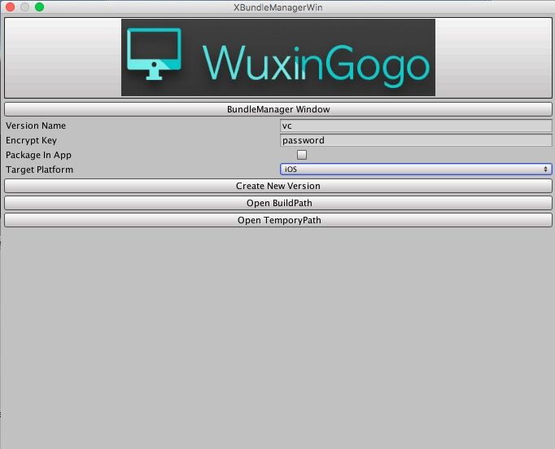
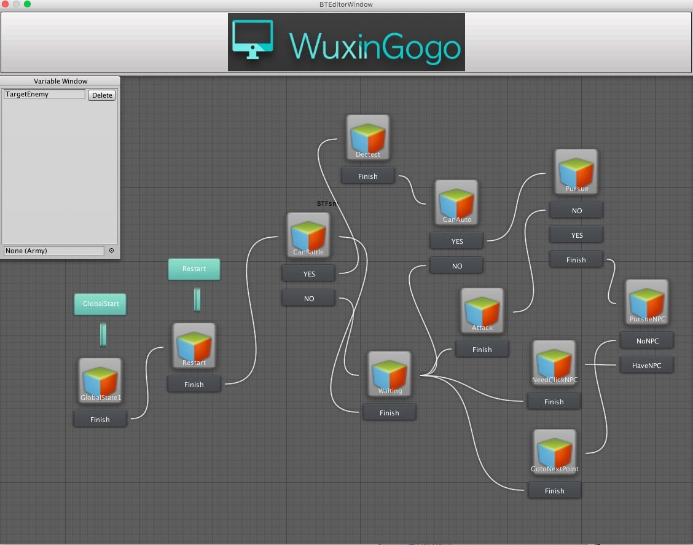
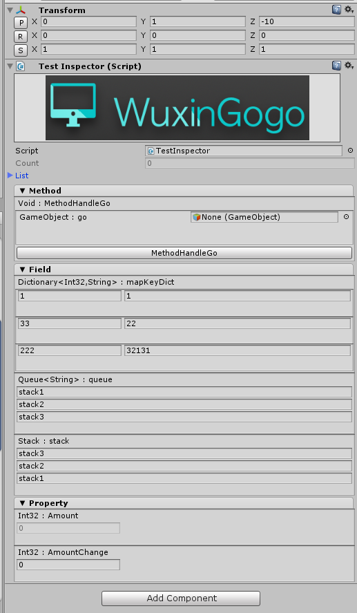
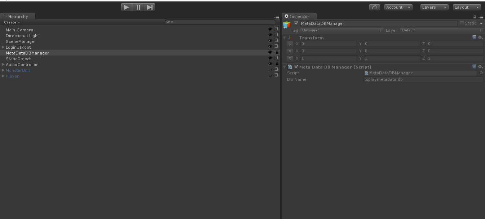

# WuxingogoExtension

## Intro
------


This repository includes full source code of the WuxingogoExtension libraries。


##Features
------

* Export UGUI to CocosUI(3.x).
* Unity Editor support: Reflection Method, Field and Property on the ReflectionWindow.
* Unity Editor support: Create AssetBundle extension (Unity 4.x && 5.x).
* Unity Editor Extension: Custom Attribute Collection(Inspector Drawer).
* Unity Editor support: Quick set unity prefs.
* Unity Editor support: Generated CSharpCode(CodeDom).
* Unity Editor support: Finite-State-Machine and Editor.
* Unity Editor support: Hierarchy Extension.
* Including a GameManager to easily manage your game.(inherit ScriptableObject)

##Usage

Copy WuxingogoExtension folder to your $project/Assets.

Command Line environment:

Windows :　msbuild, python2.7(double click build.bat)

OSX : xbuild, python2.7(run build.sh)

-----------

####XAssetBundleWindow. (Unity Version 4.X)

 

####XAssetBundleWindow. (Unity Version 5.X)

7Z Compress & Encrypt AssetsBundle

Incremental update in one file

 

This repository move to https://github.com/wuxingogo/GameUpdaterTest

####XBehaviour Window (Finite-State-Machine)

Finite-State-Machine Window.

 

This repository move to https://github.com/wuxingogo/Unity-BTFsm

####XCodeGenerateEditor:

`Save Template`

Generate `Namespace`,`Field`, `Method`, `Class`, `Comment`, `Attribute`, `Property`

TODO LIST: 

Compile Code From XReflectionWindow.

A visual window to generate csharp code.

 

####XReflectionWindow:

 


#### 3RD-Attribute

Note: This script must inherit from XMonoBehaviour.

```c#
    [X]     // Create button in the Inspector
    public void MethodHandleGo(GameObject go)
    {
        XLogger.Log("Test Method");
    }
    [X]     // Reflection this property in the Inspector
    public int Amount
    {
        get{
            return 0;
        }
    }
    private int amountChange = 0;
    [X]     
    public int AmountChange
    {
        get{
            return amountChange;
        }
        set{
            amountChange = value;
        }
    }
    [Disable]   // Disable change this SerializeField
    public int Count = 0;
    
    [X]
    public Dictionary<int, string> mapKeyDict = new Dictionary<int, string>(){
        {1,    "1"},
        {33,   "22"},
        {222,  "32131"}
    };
    [SerializeField]
    private List<string> list = new List<string>()
    {
        "stack1",
        "stack2",
        "stack3"
    };
    [X]
    public Queue<string> queue;
    [X]
    public Stack stack;

    void Reset()
    {
        stack = new Stack (list);
        queue = new Queue<string>(list);
    }

```
 


#### Hierarchy Extension

Quick toggle and lock.

 

Etc.

##Copyright, License & Contributors
-----
MIT license

Contcat:52111314ly@gmail.com, 52111314ly@sina.com

To be continue!


